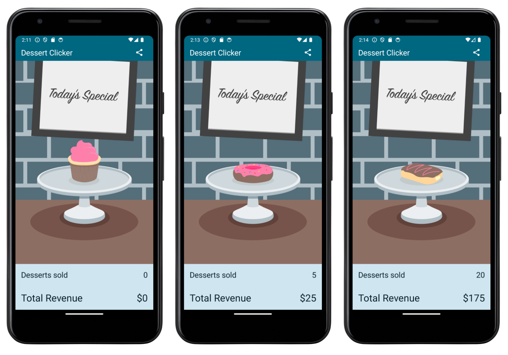

# Android ViewModel Architecture Practice Project

## Overview

This repository contains the source code for the Android ViewModel Practice Project, which is part of the Android Basics with Compose course offered by Google's Android development experts. Specifically, it corresponds to [Unit 4: Navigation and app architecture](https://developer.android.com/codelabs/basic-android-kotlin-compose-practice-navigation).

## Project Description

The goal of this project was to enhance the architecture of the existing Dessert Clicker app by introducing a ViewModel to manage data and application logic. This resulted in improved testability, readability, and code separation. 

## App Description

In the Dessert Clicker app, users can buy desserts by tapping on images. Each time a dessert image is tapped, the app updates both the total number of desserts bought and the total amount spent by the user.

## App Screenshots

## Tech Stack

- **Kotlin**: A modern programming language that is expressive, concise, and interoperable with Java.
- **Jetpack Compose**: A modern Android UI toolkit for building native UIs.
- **Android Studio IDE**: The official integrated development environment (IDE) for Android app development.
